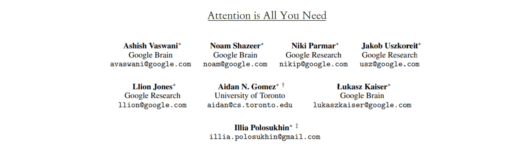
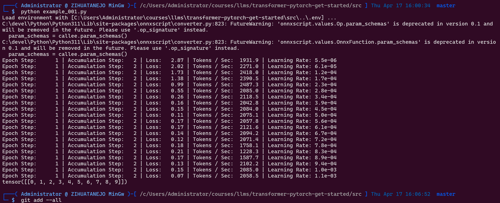
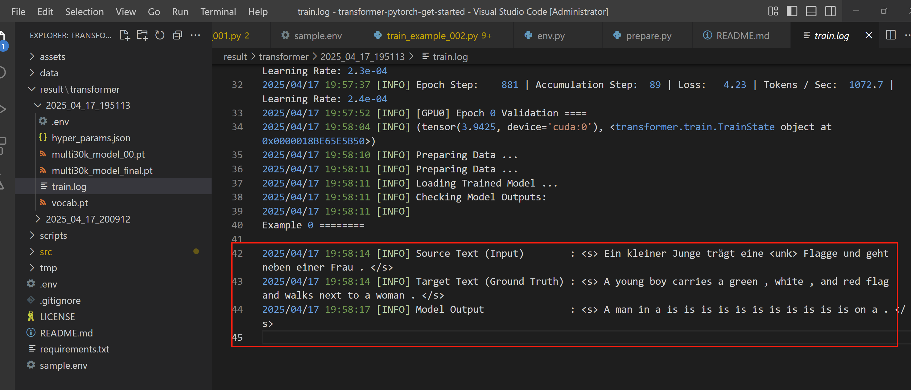

# transformer-pytorch-get-started
[https://github.com/hailiang-wang/transformer-pytorch-get-started](https://github.com/hailiang-wang/transformer-pytorch-get-started)

<!-- [http://114.242.12.42:3000/hailiang-wang/transformer-pytorch-get-started](http://114.242.12.42:3000/hailiang-wang/transformer-pytorch-get-started) -->

Setup Transformer Project with [annotated-transformer](https://nlp.seas.harvard.edu/annotated-transformer/) by upgrading library, etc.



## Install

```
pip install -r requirements.txt
```

*Required `torch==2.6.0+cu124`.


## Run exmaple


### 001. A First  Example

We can begin by trying out a simple copy-task. Given a random set
of input symbols from a small vocabulary, the goal is to generate
back those same symbols.

```
./scripts/002.run_example_001.sh
```




### 002. A Real Word Example

First, run 

```
./scripts/002.train_example_002.sh
```

By the first time, it comes to error, `UnicodeDecodeError: 'utf-8' codec can't decode byte 0x80 in position 37: invalid start byte`, then, use this solution [https://blog.csdn.net/samurais/article/details/147311770](https://blog.csdn.net/samurais/article/details/147311770)

```
cd C:\Users\Administrator\AppData\Local\Temp\tarchtext\datasets\Multi30k
tar -zxvf mmt16_task1_test.tar.gz
```

Further, run the previous script again.

```
./scripts/002.train_example_002.sh
```

Later, get result



# License

[LICENSE](./LICENSE)